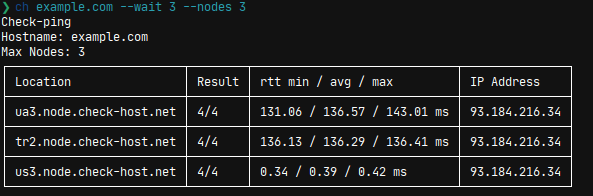

# check-host

A CLI and API Wrapper for https://check-host.net

## Usage

```
> ch --help

Usage: ch [OPTIONS] <HOST>

Arguments:
  <HOST>  The hostname to check

Options:
  -t, --type <TYPE>    CHECKTYPE <ping | http | tcp | dns | udp> [default: ping]
  -n, --nodes <NODES>  Maximum number of nodes used for the check. 0 = max [default: 0]
  -w, --wait <WAIT>    Wait for seconds before checking the result [default: 0]
  -h, --help           Print help
  -V, --version        Print version
```



##

### some things to note

I am a beginner and this is a project I made to learn more on Rust. Code is ugly, pls help in making it beautiful ~~

##

**@tbdsux | 2023**
